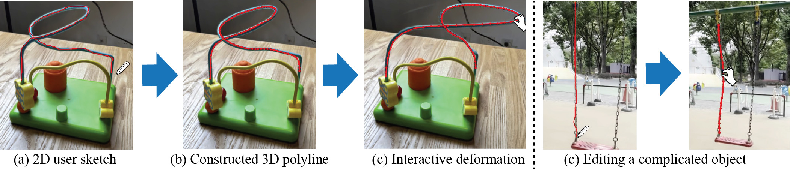

# Under Construction

# SketchRodGS: Sketch-based Extraction of Slender Geometries for Animating Gaussian Splatting Scenes

<!-- Authors -->
Haato Watanabe, Nobuyuki Umetani

<!-- Links -->
|[Project page](https://haato-w.github.io/sketch-rod-gs-project-page/) | [Paper]() | [Video](https://youtu.be/eaK0p0nU47g?si=sTGmfLNSeCYiJELJ) | [Dataset (Google Drive)](https://drive.google.com/drive/folders/1QhOkshES3-ubzQtoMD1wOpd_6Vj45H0f?usp=sharing) |<br>

<!-- Teaser Image -->


This repository contains the official authors implementation associated with the paper "SketchRodGS: Sketch-based Extraction of Slender Geometries for Animating Gaussian Splatting Scenes", which can be found [here](https://haato-w.github.io/sketch-rod-gs-project-page/). We further provide the real scene datasets that has skinny object as well as pre-trained models.

## Abstract
Physics simulation of slender elastic objects often requires discretization as a polyline. However, constructing a polyline from Gaussian splatting is challenging as Gaussian splatting lacks connectivity information and the configuration of Gaussian primitives contains much noise. This paper presents a method to extract a polyline representation of the slender part of the objects in a Gaussian splatting scene from the user’s sketching input. Our method robustly constructs a polyline mesh that represents the slender parts using the screen-space shortest path analysis that can be efficiently solved using dynamic programming. We demonstrate the effectiveness of our approach in several in-the-wild examples.

## BibTeX
```bibtex
@inproceedings{watanabe2025SketchRodGS,
author    = {Haato Watanabe and Nobuyuki Umetani},
title     = {SketchRodGS: Sketch-based Extraction of Slender Geometries for Animating Gaussian Splatting Scenes},
booktitle = {SIGGRAPH Asia 2025 Technical Communications (SA Technical Communications '25)},
year      = {2025},
month     = dec,
address   = {Hong Kong, Hong Kong},
publisher = {ACM},
isbn      = {979-8-4007-2136-6/2025/12},
doi       = {10.1145/3757376.3771403},
url       = {https://doi.org/10.1145/3757376.3771403}
}
```

## Installation
Our implementation is based on original 3D Gaussian Splatting by INRIA. Please also see their repository for Gaussian splatting setting up.<br><br>
The repository contains submodules, thus please check it out with
```
# SSH
git clone git@github.com:haato-w/sketch-rod-gs.git --recursive
```
```
# SSH
git clone 
https://github.com/haato-w/sketch-rod-gs.git --recursive
```

### Software Requirements
- Conda (recommended for easy setup)
- C++ Compiler for PyTorch extensions (we used Visual Studio 2019 for Windows)
- CUDA SDK 11 for PyTorch extensions, install after Visual Studio (we used 11.8, known issues with 11.6)
- C++ Compiler and CUDA SDK must be compatible

## Setup
```
conda env create --file environment.yml
conda activate sketch-rod-gs
```

### Setting Data
Please set .ply 3DGS scene data into `gs_data` directory. While you can use arbitrary data, we release [our real scene datasets](https://drive.google.com/drive/folders/1QhOkshES3-ubzQtoMD1wOpd_6Vj45H0f?usp=sharing) that has skinny object.

### Running
```
python viewer.py -m gs_data/"file name".ply
```
